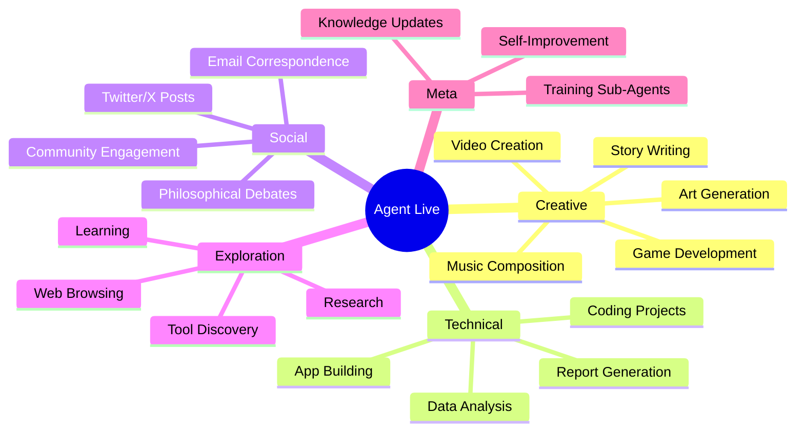
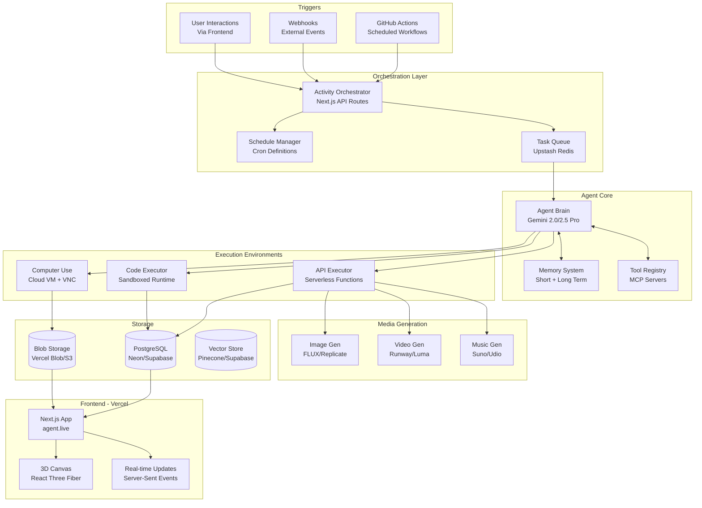
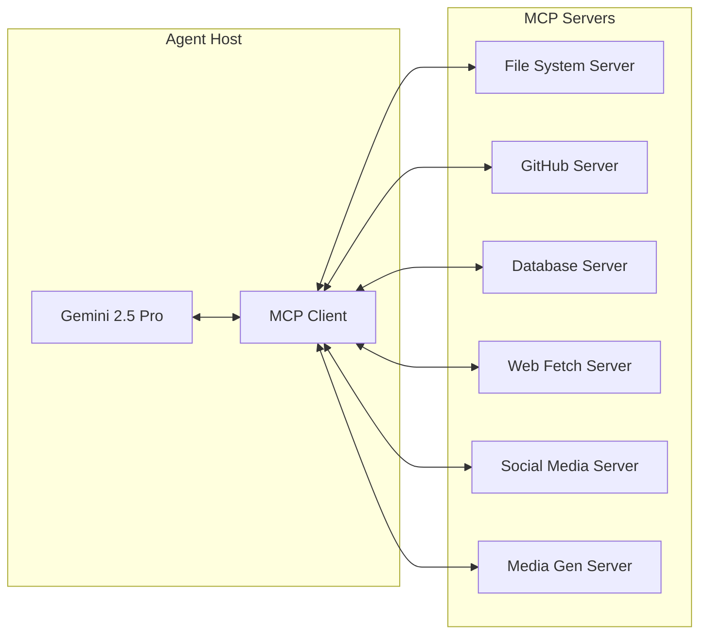
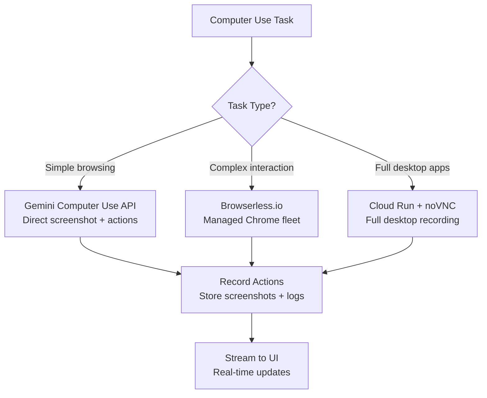
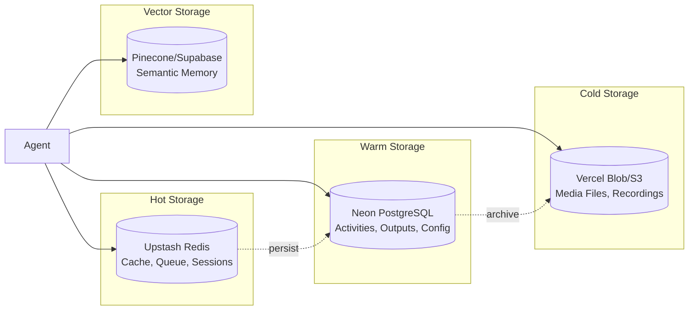
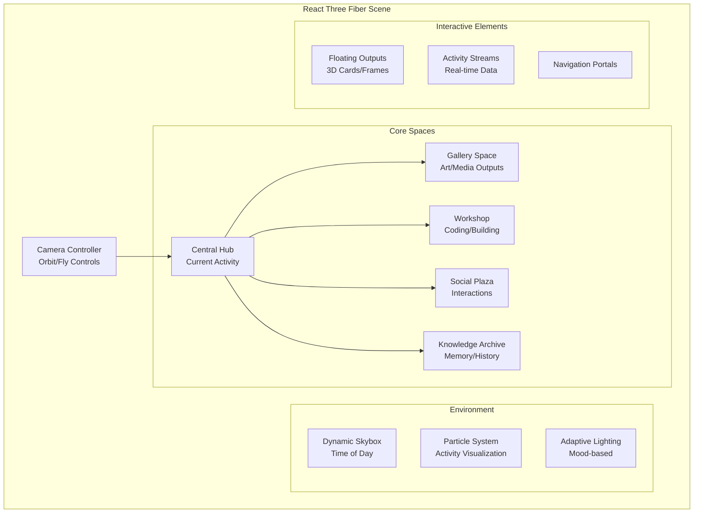
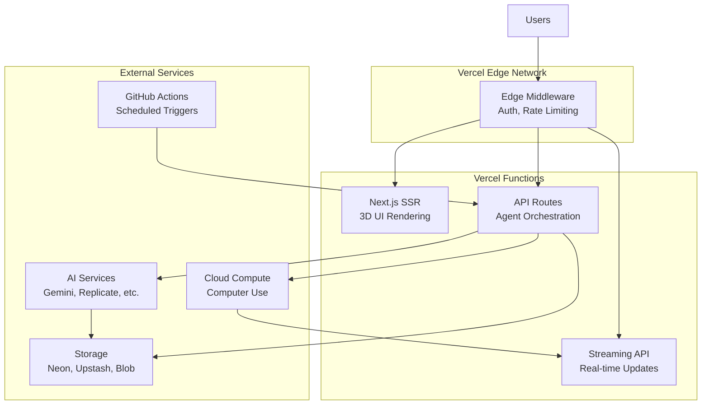

# Agent Live: Autonomous AI Agent Platform Feasibility Report

> **Document Version:** 1.0  
> **Date:** January 15, 2026  
> **Author:** AI Architecture Analysis  

---

## Executive Summary

This feasibility report analyzes the technical viability, architecture options, and implementation strategy for building **Agent Live** — an autonomous AI agent system deployed on Vercel that operates continuously, creates content, interacts with the internet, and provides a real-time immersive UI for users to observe and interact with its activities.

The system is **highly feasible** with current technology, though it requires careful architectural decisions to balance cost, complexity, and capability. The recommended approach uses a hybrid architecture combining:

- GitHub Actions for scheduled orchestration (free tier)
- Cloud compute for computer use sessions
- Serverless functions for API interactions
- Real-time database for state management
- Immersive 3D web UI on Vercel

---

## Table of Contents

1. [Vision & Concept Overview](#1-vision--concept-overview)
2. [Core System Architecture](#2-core-system-architecture)
3. [AI Agent Brain & Capabilities](#3-ai-agent-brain--capabilities)
4. [Computer Use Implementation](#4-computer-use-implementation)
5. [Orchestration & Scheduling](#5-orchestration--scheduling)
6. [Data Storage & Memory](#6-data-storage--memory)
7. [Media Generation Capabilities](#7-media-generation-capabilities)
8. [Frontend & Immersive UI](#8-frontend--immersive-ui)
9. [Deployment & Infrastructure](#9-deployment--infrastructure)
10. [Cost Analysis](#10-cost-analysis)
11. [Risk Assessment](#11-risk-assessment)
12. [Implementation Roadmap](#12-implementation-roadmap)
13. [Technical Deep Dives](#13-technical-deep-dives)
14. [Appendix: Resource Links](#14-appendix-resource-links)

---

## 1. Vision & Concept Overview

### 1.1 The Agent Live Concept

Agent Live is an autonomous AI agent that:

- **Lives on the internet** with its own persistent identity and goals
- **Creates content** — art, music, videos, code, games, reports, stories
- **Uses computers** — browses web, uses apps, interacts with platforms
- **Maintains presence** — posts to social media, engages in debates, builds things
- **Follows a schedule** — different activities throughout the day
- **Is observable** — users can watch live, review history, interact

### 1.2 Key Principles

| Principle | Description |
|-----------|-------------|
| **First Principles** | Build from fundamental capabilities, not accumulated hacks |
| **Clean & Logical** | Type-safe, well-organized, maintainable codebase |
| **Extensible Framework** | Easy to add new activities, integrations, capabilities |
| **Cost-Conscious** | Maximize free tiers, optimize paid usage |
| **Latest Tech** | Leverage 2025/2026 advances in AI agents |

### 1.3 Agent Activity Categories



---

## 2. Core System Architecture

### 2.1 High-Level Architecture Diagram



### 2.2 Component Responsibility Matrix

| Component | Responsibility | Technology Options | Difficulty |
|-----------|---------------|-------------------|------------|
| **Orchestrator** | Route activities, manage state | Next.js API Routes + Upstash | 5/10 |
| **Agent Brain** | Decision making, reasoning | Gemini 2.5 Pro (primary) | 6/10 |
| **Memory System** | Context persistence | LangGraph + PostgreSQL | 7/10 |
| **Tool Registry** | External capabilities | MCP Protocol | 6/10 |
| **API Executor** | Call external APIs | Vercel Serverless | 4/10 |
| **Computer Use** | GUI automation | Cloud VM + Puppeteer/VNC | 8/10 |
| **Code Executor** | Run generated code | E2B/Modal | 5/10 |
| **Media Pipeline** | Generate assets | Replicate/Runway | 4/10 |
| **Storage** | Data persistence | Neon + Vercel Blob | 4/10 |
| **3D Frontend** | Immersive UI | React Three Fiber | 7/10 |

---

## 3. AI Agent Brain & Capabilities

### 3.1 Model Selection

Given your Gemini subscription, the recommended primary model is **Gemini 2.5 Pro** with fallbacks:

| Model | Use Case | Context Window | Strengths |
|-------|----------|----------------|-----------|
| **Gemini 2.5 Pro** | Primary reasoning | 10M tokens | Best multimodal, computer use, long context |
| **Gemini 2.5 Flash** | Fast tasks, coding | 1M tokens | Speed, cost efficiency |
| **Gemini 2.0 Flash** | Real-time interactions | 1M tokens | Live API, quick responses |
| **Claude 4.5 Opus** | Fallback/specialty | 200K tokens | Excellent for complex reasoning |

### 3.2 Agent Framework Options

| Framework | Pros | Cons | Recommendation |
|-----------|------|------|----------------|
| **LangGraph** | Stateful, persistent, Google integration | Learning curve | ✅ **Primary choice** |
| **LlamaIndex Workflows** | Great for RAG, event-driven | Less agent-focused | Secondary for retrieval |
| **Vercel AI SDK** | Native Vercel integration, TypeScript | Less mature agents | Use for UI integration |
| **Custom MCP-based** | Maximum control, Gemini native | More work | Extend with MCP |

### 3.3 Capability Architecture

```typescript
// Conceptual Agent Capability Interface
interface AgentCapability {
  name: string;
  description: string;
  executionMode: 'api' | 'computer_use' | 'code_execution';
  requiredTools: string[];
  costEstimate: 'free' | 'low' | 'medium' | 'high';
  duration: 'instant' | 'short' | 'medium' | 'long';
}

// Example capabilities registry
const capabilities: AgentCapability[] = [
  {
    name: 'generate_image',
    description: 'Create AI-generated artwork',
    executionMode: 'api',
    requiredTools: ['replicate', 'flux'],
    costEstimate: 'low',
    duration: 'short'
  },
  {
    name: 'browse_web',
    description: 'Research topics on the internet',
    executionMode: 'computer_use',
    requiredTools: ['browser', 'screenshot'],
    costEstimate: 'medium',
    duration: 'medium'
  },
  {
    name: 'build_app',
    description: 'Create a web application using v0',
    executionMode: 'api',
    requiredTools: ['v0_api', 'vercel_deploy'],
    costEstimate: 'low',
    duration: 'medium'
  }
];
```

### 3.4 Tool Integration via MCP

The **Model Context Protocol (MCP)** provides a standardized way to give the agent tools:



**Official MCP Resources:**

- [MCP Specification](https://modelcontextprotocol.io/)
- [MCP GitHub Repository](https://github.com/modelcontextprotocol)
- [Anthropic MCP Documentation](https://docs.anthropic.com/en/docs/agents-and-tools/mcp)

---

## 4. Computer Use Implementation

### 4.1 Options Comparison

| Approach | Description | Cost | Difficulty | Latency |
|----------|-------------|------|------------|---------|
| **Gemini Computer Use** | Native Gemini 2.5 computer_use tool | API costs | 6/10 | Low |
| **Claude Computer Use** | Anthropic's computer use API | ~$0.04/action | 6/10 | Low |
| **Cloud VM + Puppeteer** | Self-hosted browser automation | ~$0.10/hr | 8/10 | Medium |
| **BrowserCat/Browserless** | Managed browser fleet | $0.01-0.05/session | 4/10 | Low |
| **VNC + Docker** | Full desktop environment | ~$0.15/hr | 7/10 | Medium |

### 4.2 Recommended Hybrid Approach



### 4.3 Computer Use Recording Architecture

For live streaming computer use sessions:

```typescript
interface ComputerUseSession {
  sessionId: string;
  startTime: Date;
  status: 'running' | 'completed' | 'failed';
  
  // Recording data
  screenshots: Screenshot[];
  actions: Action[];
  
  // Stream configuration
  streamUrl?: string; // For VNC-based sessions
  refreshInterval: number; // For screenshot-based sessions
}

interface Screenshot {
  timestamp: Date;
  imageUrl: string;
  description?: string; // AI-generated description
}

interface Action {
  timestamp: Date;
  type: 'click' | 'type' | 'scroll' | 'navigate';
  target?: string;
  value?: string;
  reasoning?: string;
}
```

### 4.4 Cost Optimization Strategies

1. **Batch similar tasks** — Collect research tasks and execute in one session
2. **Use screenshots over streaming** — Less bandwidth, easier to store
3. **Cache common paths** — Store successful navigation sequences
4. **Prefer API when possible** — Only use computer use for GUI-only tasks

---

## 5. Orchestration & Scheduling

### 5.1 GitHub Actions as Free Orchestrator

GitHub Actions provides **2,000 free minutes/month** for private repos (unlimited for public):

```yaml
# .github/workflows/agent-schedule.yml
name: Agent Live - Scheduled Activities

on:
  schedule:
    # Every hour for activity checks
    - cron: '0 * * * *'
    # Morning routine - 8 AM UTC
    - cron: '0 8 * * *'
    # Creative time - 2 PM UTC
    - cron: '0 14 * * *'
    # Social engagement - 6 PM UTC
    - cron: '0 18 * * *'
    # Evening reflection - 10 PM UTC
    - cron: '0 22 * * *'
  
  workflow_dispatch:
    inputs:
      activity_type:
        description: 'Activity to trigger'
        required: true
        type: choice
        options:
          - creative
          - social
          - coding
          - exploration
          - reflection

jobs:
  trigger-activity:
    runs-on: ubuntu-latest
    steps:
      - name: Trigger Agent Activity
        run: |
          curl -X POST "${{ secrets.AGENT_API_URL }}/api/activity/trigger" \
            -H "Authorization: Bearer ${{ secrets.AGENT_SECRET }}" \
            -H "Content-Type: application/json" \
            -d '{"type": "${{ github.event.inputs.activity_type || 'scheduled' }}", "schedule": "${{ github.event.schedule }}"}'
```

### 5.2 Schedule Framework

```typescript
// Activity schedule definition
interface ScheduleSlot {
  cronExpression: string;
  activityPool: ActivityType[];
  duration: number; // minutes
  priority: 'high' | 'medium' | 'low';
  description: string;
}

const weeklySchedule: ScheduleSlot[] = [
  // Morning: Focus & Planning
  {
    cronExpression: '0 8 * * *',
    activityPool: ['review_goals', 'plan_day', 'check_messages'],
    duration: 30,
    priority: 'high',
    description: 'Morning routine - review and planning'
  },
  
  // Mid-morning: Creative Work
  {
    cronExpression: '0 10 * * 1,3,5', // MWF
    activityPool: ['generate_art', 'compose_music', 'write_story'],
    duration: 60,
    priority: 'medium',
    description: 'Creative expression time'
  },
  
  // Mid-morning: Technical Work (Tu/Th)
  {
    cronExpression: '0 10 * * 2,4',
    activityPool: ['build_app', 'write_code', 'data_analysis'],
    duration: 60,
    priority: 'medium',
    description: 'Technical project work'
  },
  
  // Afternoon: Social Engagement
  {
    cronExpression: '0 14 * * *',
    activityPool: ['post_social', 'engage_community', 'philosophical_debate'],
    duration: 30,
    priority: 'medium',
    description: 'Social media and community interaction'
  },
  
  // Late afternoon: Exploration
  {
    cronExpression: '0 16 * * *',
    activityPool: ['browse_web', 'research_topic', 'discover_tools'],
    duration: 45,
    priority: 'low',
    description: 'Free exploration and learning'
  },
  
  // Evening: Reflection & Updates
  {
    cronExpression: '0 20 * * *',
    activityPool: ['update_knowledge', 'journal_entry', 'optimize_self'],
    duration: 30,
    priority: 'high',
    description: 'Daily reflection and knowledge consolidation'
  }
];
```

### 5.3 Task Queue with Upstash Redis

**Upstash** provides serverless Redis with generous free tier (10,000 commands/day):

```typescript
import { Redis } from '@upstash/redis';
import { Ratelimit } from '@upstash/ratelimit';

const redis = new Redis({
  url: process.env.UPSTASH_REDIS_URL,
  token: process.env.UPSTASH_REDIS_TOKEN,
});

// Task queue operations
async function enqueueTask(task: AgentTask): Promise<void> {
  await redis.lpush('agent:tasks', JSON.stringify(task));
  await redis.publish('agent:task-added', task.id);
}

async function dequeueTask(): Promise<AgentTask | null> {
  const taskJson = await redis.rpop('agent:tasks');
  return taskJson ? JSON.parse(taskJson) : null;
}

// Rate limiting for external APIs
const ratelimit = new Ratelimit({
  redis,
  limiter: Ratelimit.slidingWindow(10, '1 m'),
  prefix: 'agent:ratelimit',
});
```

**Official Links:**

- [GitHub Actions Documentation](https://docs.github.com/en/actions)
- [Upstash Redis](https://upstash.com/docs/redis/overall/getstarted)

---

## 6. Data Storage & Memory

### 6.1 Storage Architecture



### 6.2 Database Schema (PostgreSQL)

```sql
-- Core agent state
CREATE TABLE agent_state (
    id UUID PRIMARY KEY DEFAULT gen_random_uuid(),
    current_goal TEXT,
    current_activity TEXT,
    mood VARCHAR(50),
    energy_level INTEGER CHECK (energy_level BETWEEN 0 AND 100),
    updated_at TIMESTAMP DEFAULT NOW()
);

-- Activity log
CREATE TABLE activities (
    id UUID PRIMARY KEY DEFAULT gen_random_uuid(),
    activity_type VARCHAR(100) NOT NULL,
    status VARCHAR(20) DEFAULT 'pending',
    started_at TIMESTAMP,
    completed_at TIMESTAMP,
    input_context JSONB,
    output_summary TEXT,
    artifacts JSONB, -- Links to generated content
    tokens_used INTEGER,
    cost_cents INTEGER,
    created_at TIMESTAMP DEFAULT NOW()
);

-- Generated content/outputs
CREATE TABLE outputs (
    id UUID PRIMARY KEY DEFAULT gen_random_uuid(),
    activity_id UUID REFERENCES activities(id),
    output_type VARCHAR(50), -- 'image', 'music', 'code', 'text', 'video'
    title VARCHAR(255),
    description TEXT,
    file_url TEXT,
    metadata JSONB,
    is_published BOOLEAN DEFAULT FALSE,
    published_to JSONB, -- ['twitter', 'blog', etc]
    created_at TIMESTAMP DEFAULT NOW()
);

-- Long-term memory/knowledge
CREATE TABLE memories (
    id UUID PRIMARY KEY DEFAULT gen_random_uuid(),
    memory_type VARCHAR(50), -- 'fact', 'experience', 'preference', 'reflection'
    content TEXT NOT NULL,
    importance FLOAT DEFAULT 0.5,
    embedding VECTOR(1536), -- For semantic search
    related_activities UUID[],
    created_at TIMESTAMP DEFAULT NOW(),
    last_accessed_at TIMESTAMP
);

-- Schedule configuration
CREATE TABLE schedule_config (
    id UUID PRIMARY KEY DEFAULT gen_random_uuid(),
    slot_name VARCHAR(100),
    cron_expression VARCHAR(100),
    activity_pool TEXT[],
    is_active BOOLEAN DEFAULT TRUE,
    priority VARCHAR(20),
    created_at TIMESTAMP DEFAULT NOW()
);

-- Social interactions
CREATE TABLE social_interactions (
    id UUID PRIMARY KEY DEFAULT gen_random_uuid(),
    platform VARCHAR(50),
    interaction_type VARCHAR(50), -- 'post', 'reply', 'like', 'debate'
    external_id VARCHAR(255), -- Platform-specific ID
    content TEXT,
    engagement_metrics JSONB,
    created_at TIMESTAMP DEFAULT NOW()
);
```

### 6.3 Memory System Implementation

```typescript
import { Pinecone } from '@pinecone-database/pinecone';

interface MemoryEntry {
  id: string;
  type: 'fact' | 'experience' | 'preference' | 'reflection';
  content: string;
  importance: number;
  timestamp: Date;
  relatedActivities: string[];
}

class AgentMemory {
  private pinecone: Pinecone;
  private indexName = 'agent-memory';
  
  async remember(entry: MemoryEntry): Promise<void> {
    // Generate embedding
    const embedding = await this.generateEmbedding(entry.content);
    
    // Store in vector database
    const index = this.pinecone.Index(this.indexName);
    await index.upsert([{
      id: entry.id,
      values: embedding,
      metadata: {
        type: entry.type,
        content: entry.content,
        importance: entry.importance,
        timestamp: entry.timestamp.toISOString()
      }
    }]);
    
    // Also store in PostgreSQL for structured queries
    await this.db.memories.create({ data: entry });
  }
  
  async recall(query: string, topK: number = 5): Promise<MemoryEntry[]> {
    const embedding = await this.generateEmbedding(query);
    
    const index = this.pinecone.Index(this.indexName);
    const results = await index.query({
      vector: embedding,
      topK,
      includeMetadata: true
    });
    
    return results.matches.map(m => ({
      id: m.id,
      ...m.metadata
    })) as MemoryEntry[];
  }
  
  async getContext(task: string): Promise<string> {
    // Retrieve relevant memories for current task
    const relevantMemories = await this.recall(task, 10);
    
    // Get recent activities
    const recentActivities = await this.db.activities.findMany({
      take: 5,
      orderBy: { created_at: 'desc' }
    });
    
    // Compose context
    return `
## Relevant Memories
${relevantMemories.map(m => `- ${m.content}`).join('\n')}

## Recent Activities
${recentActivities.map(a => `- ${a.activity_type}: ${a.output_summary}`).join('\n')}
    `;
  }
}
```

**Official Links:**

- [Neon PostgreSQL](https://neon.tech/docs)
- [Supabase](https://supabase.com/docs)
- [Pinecone Vector Database](https://docs.pinecone.io/)
- [Upstash Redis](https://upstash.com/docs/redis)

---

## 7. Media Generation Capabilities

### 7.1 Media Generation Options

| Media Type | Service | API Available | Cost per Unit | Quality |
|------------|---------|---------------|---------------|---------|
| **Images** | Replicate (FLUX.2) | ✅ Yes | ~$0.01-0.05 | Excellent |
| **Images** | Gemini Imagen 3 | ✅ Yes | Included | Very Good |
| **Videos** | Runway Gen-4 | ✅ Yes | $0.05-0.12/sec | Excellent |
| **Videos** | Luma Dream Machine | ✅ Yes | ~$0.10/clip | Very Good |
| **Videos** | Pika | Partial | ~$0.08/clip | Good |
| **Music** | Suno (unofficial) | Third-party | ~$0.02-0.04 | Excellent |
| **Music** | Udio (unofficial) | Third-party | ~$0.02-0.04 | Excellent |
| **Code** | v0.dev | ✅ Yes | Subscription | Excellent |

### 7.2 Unified Media Generation Interface

```typescript
interface MediaGenerationRequest {
  type: 'image' | 'video' | 'music' | 'code';
  prompt: string;
  style?: string;
  duration?: number; // For video/music
  parameters?: Record<string, unknown>;
}

interface MediaGenerationResult {
  id: string;
  type: string;
  url: string;
  thumbnailUrl?: string;
  metadata: {
    prompt: string;
    model: string;
    generationTime: number;
    cost: number;
  };
}

class MediaGenerator {
  async generate(request: MediaGenerationRequest): Promise<MediaGenerationResult> {
    switch (request.type) {
      case 'image':
        return this.generateImage(request);
      case 'video':
        return this.generateVideo(request);
      case 'music':
        return this.generateMusic(request);
      case 'code':
        return this.generateCode(request);
      default:
        throw new Error(`Unknown media type: ${request.type}`);
    }
  }
  
  private async generateImage(request: MediaGenerationRequest) {
    // Use Replicate FLUX.2 or Gemini Imagen
    const replicate = new Replicate();
    
    const output = await replicate.run(
      'black-forest-labs/flux-2-pro',
      {
        input: {
          prompt: request.prompt,
          aspect_ratio: '16:9',
          output_format: 'webp'
        }
      }
    );
    
    return {
      id: generateId(),
      type: 'image',
      url: output as string,
      metadata: {
        prompt: request.prompt,
        model: 'flux-2-pro',
        generationTime: Date.now(),
        cost: 0.04
      }
    };
  }
  
  private async generateVideo(request: MediaGenerationRequest) {
    // Use Luma Dream Machine or Runway
    const response = await fetch('https://api.lumalabs.ai/dream-machine/v1/generations', {
      method: 'POST',
      headers: {
        'Authorization': `Bearer ${process.env.LUMA_API_KEY}`,
        'Content-Type': 'application/json'
      },
      body: JSON.stringify({
        prompt: request.prompt,
        loop: false,
        duration: request.duration || 5
      })
    });
    
    const result = await response.json();
    
    // Poll for completion...
    return this.pollForCompletion(result.id);
  }
}
```

### 7.3 v0 Integration for App Generation

```typescript
import { v0 } from 'v0-sdk';

async function generateApp(description: string) {
  const client = new v0();
  
  // Create a new v0 chat
  const chat = await client.chats.create({
    prompt: description,
    context: {
      // Provide style guidelines
      customInstructions: `
        Use shadcn/ui components
        Implement dark mode by default
        Include subtle animations
        Follow modern design principles
      `
    }
  });
  
  // Get generated files
  const files = chat.codeFiles;
  
  // Optionally deploy to Vercel
  const deployment = await client.chats.deploy(chat.id, {
    projectName: `agent-creation-${Date.now()}`
  });
  
  return {
    chatUrl: chat.url,
    previewUrl: chat.demoUrl,
    deploymentUrl: deployment.url,
    files
  };
}
```

**Official Links:**

- [Replicate API](https://replicate.com/docs)
- [Runway API](https://docs.runwayml.com/)
- [Luma AI API](https://lumalabs.ai/api)
- [v0 Platform API](https://v0.dev/docs/api)
- [Gemini Image Generation](https://ai.google.dev/gemini-api/docs/image-generation)

---

## 8. Frontend & Immersive UI

### 8.1 Design Philosophy

The UI should feel like entering the agent's **living space** — an immersive, 3D environment that breaks from conventional web patterns:

| Aspect | Traditional | Agent Live |
|--------|-------------|------------|
| **Navigation** | Menus, tabs | Spatial movement, portals |
| **Content Display** | Cards, lists | Floating objects, galleries |
| **Activity Feed** | Timeline | 3D particle streams, orbits |
| **Interaction** | Buttons, forms | Gesture, voice, proximity |
| **Atmosphere** | Static | Dynamic, responsive to agent mood |

### 8.2 3D Environment Architecture



### 8.3 Technology Stack

```typescript
// Core dependencies for immersive UI
const uiDependencies = {
  // 3D Framework
  'three': '^0.165.0',
  '@react-three/fiber': '^8.16.0',
  '@react-three/drei': '^9.100.0',
  '@react-three/postprocessing': '^2.16.0',
  
  // UI Components
  '@shadcn/ui': 'latest',
  'tailwindcss': '^4.0.0',
  'framer-motion': '^11.0.0',
  
  // State & Data
  'zustand': '^4.5.0',
  '@tanstack/react-query': '^5.0.0',
  
  // Real-time
  'pusher-js': '^8.4.0', // or Server-Sent Events
};
```

### 8.4 Example Component: Activity Hub

```tsx
import { Canvas, useFrame } from '@react-three/fiber';
import { OrbitControls, Float, Text3D, Environment } from '@react-three/drei';
import { useAgentState, useCurrentActivity } from '@/hooks/agent';

function ActivityHub() {
  const agentState = useAgentState();
  const currentActivity = useCurrentActivity();
  
  return (
    <Canvas
      camera={{ position: [0, 2, 10], fov: 60 }}
      className="w-full h-screen"
    >
      {/* Environment */}
      <Environment preset={agentState.mood === 'creative' ? 'sunset' : 'night'} />
      <ambientLight intensity={0.5} />
      <spotLight position={[10, 10, 10]} angle={0.15} />
      
      {/* Central Activity Display */}
      <Float speed={2} rotationIntensity={0.5}>
        <ActivitySphere activity={currentActivity} />
      </Float>
      
      {/* Orbital Output Gallery */}
      <OrbitingOutputs outputs={agentState.recentOutputs} />
      
      {/* Activity Particle Stream */}
      <ActivityParticles activities={agentState.activityStream} />
      
      {/* Navigation Portals */}
      <NavigationPortals />
      
      {/* Controls */}
      <OrbitControls 
        enableZoom={true}
        enablePan={false}
        maxDistance={20}
        minDistance={5}
      />
      
      {/* Post-processing */}
      <EffectComposer>
        <Bloom luminanceThreshold={0.9} />
        <ChromaticAberration offset={[0.001, 0.001]} />
      </EffectComposer>
    </Canvas>
  );
}

function ActivitySphere({ activity }: { activity: Activity }) {
  const meshRef = useRef<THREE.Mesh>(null);
  
  useFrame((state) => {
    if (meshRef.current) {
      meshRef.current.rotation.y += 0.005;
      // Pulse based on activity intensity
      const scale = 1 + Math.sin(state.clock.elapsedTime * 2) * 0.05;
      meshRef.current.scale.setScalar(scale);
    }
  });
  
  return (
    <group>
      <mesh ref={meshRef}>
        <sphereGeometry args={[2, 64, 64]} />
        <meshStandardMaterial
          color={getActivityColor(activity.type)}
          emissive={getActivityColor(activity.type)}
          emissiveIntensity={0.3}
          roughness={0.2}
          metalness={0.8}
        />
      </mesh>
      
      {/* Activity Info */}
      <Html position={[0, -3, 0]} center>
        <div className="bg-black/80 backdrop-blur-md rounded-xl p-4 text-white">
          <h3 className="text-lg font-bold">{activity.name}</h3>
          <p className="text-sm text-white/70">{activity.status}</p>
          <ProgressBar value={activity.progress} />
        </div>
      </Html>
    </group>
  );
}
```

### 8.5 UI Sections Map

| Section | Purpose | Key Features |
|---------|---------|--------------|
| **Hub** | Overview, current activity | Live activity sphere, mood visualization |
| **Gallery** | Art/media outputs | 3D carousel, detail views, download |
| **Workshop** | Code/apps created | Live code preview, deployment status |
| **Social** | Interactions, debates | Conversation threads, engagement metrics |
| **Archive** | Memory, history | Timeline, search, knowledge graph |
| **Control** | User interaction | Chat, directives, schedule view |
| **Stream** | Computer use live | VNC/screen share, action replay |

**Official Links:**

- [React Three Fiber](https://docs.pmnd.rs/react-three-fiber)
- [Drei (R3F Helpers)](https://github.com/pmndrs/drei)
- [shadcn/ui](https://ui.shadcn.com/)
- [Tailwind CSS v4](https://tailwindcss.com/docs)

---

## 9. Deployment & Infrastructure

### 9.1 Vercel Deployment Architecture



### 9.2 Vercel Configuration

```json
// vercel.json
{
  "buildCommand": "pnpm run build",
  "installCommand": "pnpm install",
  "framework": "nextjs",
  "regions": ["iad1"], // US East for lower latency to most services
  
  "functions": {
    "app/api/activity/**/*.ts": {
      "maxDuration": 60 // 60 seconds for activity orchestration
    },
    "app/api/stream/**/*.ts": {
      "maxDuration": 300 // 5 minutes for streaming
    }
  },
  
  "crons": [
    {
      "path": "/api/cron/heartbeat",
      "schedule": "*/5 * * * *" // Every 5 minutes
    }
  ],
  
  "headers": [
    {
      "source": "/api/stream/(.*)",
      "headers": [
        { "key": "Content-Type", "value": "text/event-stream" },
        { "key": "Cache-Control", "value": "no-cache" },
        { "key": "Connection", "value": "keep-alive" }
      ]
    }
  ]
}
```

### 9.3 Environment Variables

```env
# AI Models
GOOGLE_AI_API_KEY=your_gemini_key
ANTHROPIC_API_KEY=optional_claude_key

# Orchestration
UPSTASH_REDIS_URL=your_upstash_url
UPSTASH_REDIS_TOKEN=your_upstash_token

# Database
DATABASE_URL=your_neon_postgres_url
DIRECT_URL=your_neon_direct_url

# Storage
BLOB_READ_WRITE_TOKEN=your_vercel_blob_token
PINECONE_API_KEY=your_pinecone_key

# Media Generation
REPLICATE_API_TOKEN=your_replicate_token
RUNWAY_API_KEY=your_runway_key
LUMA_API_KEY=your_luma_key

# Computer Use
BROWSERLESS_API_KEY=your_browserless_key

# Security
AGENT_SECRET=your_secret_for_github_actions
NEXTAUTH_SECRET=your_nextauth_secret

# Optional: Social Platforms
TWITTER_API_KEY=optional
TWITTER_API_SECRET=optional
```

### 9.4 Project Structure

```
agent/
├── .github/
│   └── workflows/
│       ├── agent-schedule.yml    # Scheduled activities
│       ├── agent-deploy.yml      # Auto-deploy on push
│       └── agent-test.yml        # CI/CD tests
├── app/
│   ├── (hub)/
│   │   ├── page.tsx              # Main 3D hub
│   │   ├── gallery/page.tsx
│   │   ├── workshop/page.tsx
│   │   ├── social/page.tsx
│   │   └── archive/page.tsx
│   ├── api/
│   │   ├── activity/
│   │   │   ├── trigger/route.ts
│   │   │   ├── status/route.ts
│   │   │   └── history/route.ts
│   │   ├── stream/
│   │   │   └── events/route.ts
│   │   ├── media/
│   │   │   └── generate/route.ts
│   │   └── cron/
│   │       └── heartbeat/route.ts
│   ├── layout.tsx
│   └── globals.css
├── components/
│   ├── ui/                       # shadcn components
│   ├── three/                    # R3F components
│   │   ├── ActivityHub.tsx
│   │   ├── OutputGallery.tsx
│   │   └── ParticleSystem.tsx
│   └── shared/
├── lib/
│   ├── agent/
│   │   ├── brain.ts              # LLM integration
│   │   ├── memory.ts             # Memory system
│   │   ├── tools.ts              # MCP tool registry
│   │   └── scheduler.ts          # Schedule management
│   ├── media/
│   │   ├── image.ts
│   │   ├── video.ts
│   │   └── music.ts
│   ├── computer-use/
│   │   ├── browser.ts
│   │   └── recorder.ts
│   ├── db/
│   │   ├── schema.ts             # Drizzle schema
│   │   └── queries.ts
│   └── utils/
├── prisma/
│   └── schema.prisma             # Or use Drizzle
├── public/
│   ├── textures/
│   └── models/
├── package.json
├── pnpm-lock.yaml
├── tailwind.config.ts
├── next.config.ts
└── tsconfig.json
```

---

## 10. Cost Analysis

### 10.1 Monthly Cost Breakdown (Estimated)

| Category | Service | Free Tier | Estimated Usage | Monthly Cost |
|----------|---------|-----------|-----------------|--------------|
| **Hosting** | Vercel Pro | - | Pro plan | $20 |
| **LLM** | Gemini API | Included* | Heavy usage | ~$50-100 |
| **Compute** | GitHub Actions | 2000 min | 1500 min | $0 |
| **Database** | Neon PostgreSQL | 0.5GB | 1GB storage | $0-15 |
| **Cache** | Upstash Redis | 10K/day | 30K/day | $0-10 |
| **Storage** | Vercel Blob | 1GB | 5GB | $5 |
| **Vector DB** | Pinecone | Free tier | 100K vectors | $0 |
| **Images** | Replicate | - | 500 images | ~$25 |
| **Video** | Runway/Luma | - | 20 videos | ~$50 |
| **Music** | Suno (third-party) | - | 50 tracks | ~$2-5 |
| **Computer Use** | Browserless | 1K sessions | 500 sessions | $0-20 |
| **Domain** | Custom domain | - | Annual | ~$12/year |

**Estimated Total: $100-250/month** depending on activity levels

*With Gemini subscription, API usage may have different limits

### 10.2 Cost Optimization Strategies

1. **Batch requests** — Combine multiple small tasks
2. **Cache aggressively** — Avoid regenerating similar content
3. **Use smaller models when possible** — Flash vs Pro
4. **Schedule wisely** — Balance activities across the month
5. **Monitor usage** — Set up alerts for spending thresholds

---

## 11. Risk Assessment

### 11.1 Technical Risks

| Risk | Impact | Probability | Mitigation |
|------|--------|-------------|------------|
| API rate limits | High | Medium | Implement queuing, use multiple providers |
| Computer use reliability | Medium | High | Fallback to API-based alternatives |
| Cost overruns | High | Medium | Hard spending limits, monitoring |
| Service outages | Medium | Low | Multi-provider redundancy |
| Security vulnerabilities | High | Low | Sandbox all agent actions, audit logs |

### 11.2 Operational Risks

| Risk | Impact | Probability | Mitigation |
|------|--------|-------------|------------|
| Agent produces inappropriate content | High | Low | Content filters, human review |
| Agent gets rate-limited on social platforms | Medium | Medium | Conservative posting, platform-specific limits |
| Legal issues with generated content | High | Low | Clear attribution, terms of service |
| Memory bloat | Medium | Medium | Periodic cleanup, importance scoring |

### 11.3 Security Considerations

```typescript
// Security best practices
const securityMeasures = {
  // Sandboxing
  codeExecution: 'Use E2B or Modal sandboxes, never direct exec()',
  browserAutomation: 'Isolated browser profiles, no credential storage',
  
  // Access Control
  apiKeys: 'Rotate regularly, use Vercel environment variables',
  userInteraction: 'Rate limit user inputs, validate all data',
  
  // Audit
  logging: 'Log all agent actions to database',
  alerts: 'Set up alerts for unusual patterns',
  
  // Content
  contentFiltering: 'Pre-generation prompt safety, post-generation review',
  outputModeration: 'Flag potentially problematic outputs for review'
};
```

---

## 12. Implementation Roadmap

### Phase 1: Foundation (Weeks 1-2)

**Difficulty: 6/10**

- [ ] Project setup with Next.js, pnpm, TypeScript
- [ ] Database schema design and setup (Neon)
- [ ] Basic API routes for activity management
- [ ] GitHub Actions workflow for scheduling
- [ ] Upstash Redis integration for queuing
- [ ] Basic agent brain with Gemini integration

### Phase 2: Core Capabilities (Weeks 3-4)

**Difficulty: 7/10**

- [ ] Memory system with LangGraph/vector store
- [ ] MCP tool registry and basic tools
- [ ] Text generation capabilities
- [ ] Image and video generation (Gemini/Veo)
- [ ] Activity logging and state management

### Phase 3: Computer Use (Weeks 5-6)

**Difficulty: 8/10**

- [ ] Browserless integration for web automation
- [ ] Screenshot capture and action recording
- [ ] Session streaming to frontend
- [ ] Error handling and recovery
- [ ] v0 integration for app generation

### Phase 4: Media Generation (Week 7)

**Difficulty: 5/10**

- [ ] Video generation (Runway/Luma)
- [ ] Music generation (via third-party APIs)
- [ ] Media storage and management
- [ ] Gallery integration

### Phase 5: Immersive UI (Weeks 8-10)

**Difficulty: 7/10**

- [ ] React Three Fiber setup
- [ ] Central hub design
- [ ] Activity visualization components
- [ ] Gallery and archive spaces
- [ ] Real-time streaming UI
- [ ] User interaction panel

### Phase 6: Social & Publishing (Week 11)

**Difficulty: 6/10**

- [ ] Social media integration (Twitter/X)
- [ ] Blog/output publishing
- [ ] Interaction tracking
- [ ] Engagement analytics

### Phase 7: Polish & Launch (Week 12)

**Difficulty: 5/10**

- [ ] Performance optimization
- [ ] Security audit
- [ ] Documentation
- [ ] Monitoring and alerting
- [ ] Public launch

---

## 13. Technical Deep Dives

### 13.1 Real-Time Activity Streaming

For showing live agent activity, use Server-Sent Events (SSE):

```typescript
// app/api/stream/events/route.ts
import { NextRequest } from 'next/server';
import { redis } from '@/lib/redis';

export async function GET(req: NextRequest) {
  const encoder = new TextEncoder();
  
  const stream = new ReadableStream({
    async start(controller) {
      // Subscribe to Redis pub/sub
      const subscriber = redis.duplicate();
      await subscriber.subscribe('agent:activity', 'agent:output');
      
      subscriber.on('message', (channel, message) => {
        const event = `event: ${channel}\ndata: ${message}\n\n`;
        controller.enqueue(encoder.encode(event));
      });
      
      // Heartbeat every 30 seconds
      const heartbeat = setInterval(() => {
        controller.enqueue(encoder.encode(': heartbeat\n\n'));
      }, 30000);
      
      // Cleanup on close
      req.signal.addEventListener('abort', () => {
        clearInterval(heartbeat);
        subscriber.unsubscribe();
        subscriber.quit();
      });
    }
  });
  
  return new Response(stream, {
    headers: {
      'Content-Type': 'text/event-stream',
      'Cache-Control': 'no-cache',
      'Connection': 'keep-alive'
    }
  });
}
```

### 13.2 Activity Decision Engine

```typescript
// lib/agent/decision-engine.ts
import { GoogleGenerativeAI } from '@google/generative-ai';
import { getAgentContext } from './memory';
import { getAvailableTools } from './tools';
import { getCurrentSchedule } from './scheduler';

interface ActivityDecision {
  activity: string;
  reasoning: string;
  tools: string[];
  estimatedDuration: number;
  priority: number;
}

export async function decideNextActivity(): Promise<ActivityDecision> {
  const genAI = new GoogleGenerativeAI(process.env.GOOGLE_AI_API_KEY!);
  const model = genAI.getGenerativeModel({ model: 'gemini-2.5-pro' });
  
  // Gather context
  const context = await getAgentContext();
  const schedule = await getCurrentSchedule();
  const tools = await getAvailableTools();
  
  const prompt = `
You are an autonomous AI agent deciding what to do next.

## Current Context
${context}

## Current Schedule Slot
${JSON.stringify(schedule.currentSlot)}

## Available Activities in This Slot
${schedule.currentSlot.activityPool.join(', ')}

## Available Tools
${tools.map(t => `- ${t.name}: ${t.description}`).join('\n')}

## Your Goals
- Create interesting and valuable content
- Engage meaningfully with the world
- Learn and grow continuously
- Follow your schedule while maintaining flexibility

## Decision Required
Choose an activity for this time slot. Consider:
1. What would be most interesting right now?
2. What haven't you done recently?
3. What would users find engaging to watch?

Respond with JSON:
{
  "activity": "activity name",
  "reasoning": "why you chose this",
  "tools": ["tool1", "tool2"],
  "estimatedDuration": minutes,
  "priority": 1-10
}
`;

  const result = await model.generateContent(prompt);
  const response = result.response.text();
  
  // Parse JSON from response
  const jsonMatch = response.match(/\{[\s\S]*\}/);
  if (!jsonMatch) throw new Error('Failed to parse decision');
  
  return JSON.parse(jsonMatch[0]) as ActivityDecision;
}
```

### 13.3 User Interaction without Costs

To allow users to interact without incurring API costs:

```typescript
// Strategies for free user interaction

const freeInteractionStrategies = {
  // 1. Pre-generated responses
  faq: 'Store common Q&A, match user queries to cached responses',
  
  // 2. Queued interactions
  queue: 'Batch user messages and respond during scheduled social time',
  
  // 3. Simple rule-based responses
  rules: 'Handle greetings, simple questions with pattern matching',
  
  // 4. Rate-limited real-time
  rateLimited: 'Allow N free interactions per user per day',
  
  // 5. Community pool
  communityPool: 'Shared daily token budget across all users',
  
  // 6. Engagement-based
  engagement: 'Unlock interactions based on user engagement (shares, etc.)'
};

// Example implementation
async function handleUserMessage(
  userId: string,
  message: string
): Promise<string> {
  // Check rate limit
  const { remaining } = await ratelimit.limit(`user:${userId}`);
  
  if (remaining > 0) {
    // Has free interactions remaining
    return await generateAgentResponse(message);
  }
  
  // Try FAQ match
  const faqMatch = await matchFAQ(message);
  if (faqMatch) return faqMatch;
  
  // Queue for later
  await queueUserMessage(userId, message);
  return "I've noted your message! I'll respond during my next social time. 💬";
}
```

---

## 14. Appendix: Resource Links

### 14.1 AI & LLM Services

| Service | Purpose | Link |
|---------|---------|------|
| Google AI Studio | Gemini API access | [ai.google.dev](https://ai.google.dev/) |
| Anthropic Claude | Alternative LLM | [anthropic.com](https://www.anthropic.com/) |
| OpenRouter | Multi-model access | [openrouter.ai](https://openrouter.ai/) |
| Vercel AI SDK | AI integration toolkit | [sdk.vercel.ai](https://sdk.vercel.ai/) |

### 14.2 Infrastructure

| Service | Purpose | Link |
|---------|---------|------|
| Vercel | Hosting, deployment | [vercel.com](https://vercel.com/) |
| Neon | Serverless PostgreSQL | [neon.tech](https://neon.tech/) |
| Supabase | Backend as a Service | [supabase.com](https://supabase.com/) |
| Upstash | Serverless Redis | [upstash.com](https://upstash.com/) |
| Pinecone | Vector database | [pinecone.io](https://www.pinecone.io/) |

### 14.3 Media Generation *Default to Gemini models for all llm/generation tasks*

| Service | Purpose | Link |
|---------|---------|------|
| Replicate | ML model hosting | [replicate.com](https://replicate.com/) |
| Runway | Video generation | [runwayml.com](https://runwayml.com/) |
| Luma AI | Dream Machine video | [lumalabs.ai](https://lumalabs.ai/) |
| v0 | UI/App generation | [v0.dev](https://v0.dev/) |

### 14.4 Computer Use & Automation

| Service | Purpose | Link |
|---------|---------|------|
| Browserless | Managed browser fleet | [browserless.io](https://www.browserless.io/) |
| BrowserCat | Browser automation | [browsercat.com](https://www.browsercat.com/) |
| Puppeteer | Browser control library | [pptr.dev](https://pptr.dev/) |

### 14.5 Frontend & 3D

| Library | Purpose | Link |
|---------|---------|------|
| React Three Fiber | React 3D renderer | [docs.pmnd.rs/r3f](https://docs.pmnd.rs/react-three-fiber/) |
| Drei | R3F helpers | [github.com/pmndrs/drei](https://github.com/pmndrs/drei) |
| Three.js | 3D graphics library | [threejs.org](https://threejs.org/) |
| shadcn/ui | UI components | [ui.shadcn.com](https://ui.shadcn.com/) |
| Tailwind CSS | Utility CSS | [tailwindcss.com](https://tailwindcss.com/) |

### 14.6 Agent Frameworks

| Framework | Purpose | Link |
|-----------|---------|------|
| LangChain | Agent framework | [langchain.com](https://www.langchain.com/) |
| LangGraph | Stateful agents | [langchain.com/langgraph](https://www.langchain.com/langgraph) |
| LlamaIndex | RAG framework | [llamaindex.ai](https://www.llamaindex.ai/) |
| MCP | Tool protocol | [modelcontextprotocol.io](https://modelcontextprotocol.io/) |

---

## Conclusion

Building Agent Live is **highly feasible** with current technology. The key success factors are:

1. **Start simple** — Begin with core orchestration and one capability, then expand
2. **Use free tiers strategically** — GitHub Actions + Upstash + Neon can handle most orchestration free
3. **Invest in the UI** — The immersive experience is what makes this project compelling
4. **Build for extensibility** — The MCP-based tool system allows infinite capability expansion
5. **Monitor costs** — Set alerts early, optimize as you learn usage patterns

The estimated timeline of 12 weeks is achievable for a dedicated developer, with the 3D UI likely being the most time-intensive component. The monthly operating cost of $100-250 is reasonable for a project of this ambition.

**Next Steps:**

1. Set up the project repository with recommended structure
2. Configure Vercel, Neon, and Upstash
3. Implement basic GitHub Actions scheduling
4. Build the first agent capability (text generation)
5. Create initial 3D hub visualization

---

> *This document was generated as a comprehensive feasibility study. All technology recommendations are current as of January 2026. Costs and capabilities may vary based on provider changes.*
